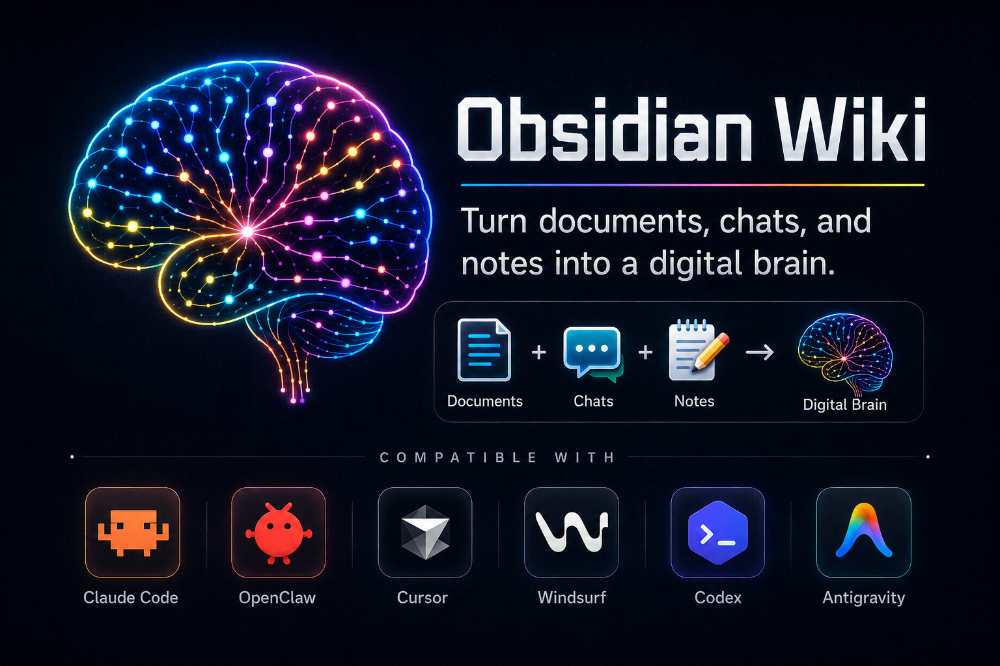

<h1 align="center">obsidian-wiki</h1>

<p align="center"><b>A digital brain you grow with your AI agent.</b></p>

<p align="center">
  It remembers what you figure out, connects it to what you already know,<br>
  and answers when you ask.
</p>

<p align="center">
  <a href="https://pypi.org/project/obsidian-wiki/"></a>
  <a href="https://github.com/ar9av/obsidian-wiki/pulls"></a>
  <a href="https://x.com/_ar9av"></a>
  <a href="https://discord.gg/FH2PRX754c"></a>
</p>

<p align="center">
  
</p>

<p align="center">
  
</p>

<p align="center">
  English | <a href="https://github.com/Ar9av/obsidian-wiki/blob/main/README_TW.md">繁體中文</a>
</p>

---

You solve a hard problem on a Tuesday. Three months later, in a different repo, you solve it again from scratch — because the answer lived in a chat log you'll never find.

This fixes that. Point it at a folder, tell your agent what to remember, and it compiles what you learn into interconnected markdown you own. The pattern comes from Andrej Karpathy's [LLM Wiki gist](https://gist.github.com/karpathy/442a6bf555914893e9891c11519de94f): compile knowledge once and keep it current, instead of asking an LLM the same questions forever or re-running RAG every time.

**Your second brain. Your AI agent is how you grow it.**

Every skill here is a markdown file that any agent — Claude Code, Cursor, Codex, Windsurf, Gemini CLI, and [a dozen more](https://github.com/Ar9av/obsidian-wiki/blob/main/docs/agents.md) — reads and runs. No runtime, no API keys, no vendor.

## 60 seconds

```bash
pip install obsidian-wiki
obsidian-wiki setup --vault ~/brain
```

That also registers the two session hooks, so every new session starts with who you are and what's open, and ends by capturing anything reusable. Pass `--no-hooks` to skip them.

Using `uv` or `pipx`? `uv tool install obsidian-wiki` and `pipx install obsidian-wiki` work the same way. (Not `uvx` — see [Installation](https://github.com/Ar9av/obsidian-wiki/blob/main/docs/installation.md#install-via-pip-uv-or-pipx-recommended).)

Then open any project in your agent and say **"set up my wiki"**.

Prefer not to touch a terminal? Give your agent this and it'll do the whole thing:

```text
https://github.com/Ar9av/obsidian-wiki — set up my wiki
```

Using Claude Code? Install it as a plugin instead — no Python needed:

```text
/plugin marketplace add Ar9av/obsidian-wiki
/plugin install obsidian-wiki@obsidian-wiki
```

Plugin skills are namespaced (`/obsidian-wiki:wiki-ingest`), and the plugin ships the skills only — not the session hooks or the `obsidian-wiki` CLI.

Other paths — `git clone`, Claude Code plugin, Skills CLI, multiple vaults → **[Installation](https://github.com/Ar9av/obsidian-wiki/blob/main/docs/installation.md)**

## What you actually do

**Feed it.** Anything text-shaped: docs, PDFs, chat exports, meeting transcripts, screenshots, URLs.

```text
/wiki-ingest ~/research
/wiki-update                        # distill the repo you're standing in (code-graph aware)
/wiki-capture                       # save this conversation
/wiki-history-ingest claude         # mine everything you've ever asked Claude
```

**Ask it.** Answers come back with `[[wikilink]]` citations, not vibes.

```text
/wiki-query what do I know about rate limiting?
/wiki-narrate MCP security          # a cited briefing on a topic
/wiki-digest week                   # what did I learn this week?
```

**Find that session you can't name.**

```bash
obsidian-wiki sessions-build
obsidian-wiki sessions-query "the auth bug with the weird retry loop"
```

**Keep it honest.** The vault gets messy on its own; these clean it.

```text
/wiki-lint            # broken links, orphans, contradictions
/wiki-dedup           # "RSC" and "React Server Components" are one page now
/cross-linker         # weave new pages into the graph
/wiki-status          # what's ingested, what's pending, where the hubs are
```

All 39 skills → **[Skills Reference](https://github.com/Ar9av/obsidian-wiki/blob/main/docs/skills.md)**

## See it

Open the vault in Obsidian and hit the graph view (Cmd/Ctrl+P → "Open graph view"). Say **"color my graph"** and it tints nodes by tag, category, or visibility.

Want to look before you build? [`examples/demo-vault/`](https://github.com/Ar9av/obsidian-wiki/tree/main/examples/demo-vault) is an 18-page sample vault on building reliable LLM agents, already colored by folder. Clone the repo, choose *Open folder as vault* in Obsidian, and pick that folder.

<p align="center">
  
</p>

Or export the whole graph to `graph.json`, GraphML (Gephi/yEd), Neo4j Cypher, Postgres SQL, or a self-contained interactive `graph.html`.

## Use it from Python

```python
from obsidian_wiki import Memory

memory = Memory("~/brain")
memory.remember("stack", "Python, FastAPI", confidence=0.9)
memory.add("Postgres was chosen over MySQL for partial indexes.")
memory.search("postgres")
memory.recap()                       # inject at session start
```

No API key, no embedding model, no vector store, no network — the vault is markdown on disk, so everything your agent remembers is readable, greppable and diffable. `user_id` scopes per-person memory while knowledge stays shared.

More → **[Python API](https://github.com/Ar9av/obsidian-wiki/blob/main/docs/python-api.md)**

## It remembers between sessions

A session starts with the vault's memory already in context — who you are, what threads are open, what changed recently — and ends by capturing anything reusable before the context closes.

<p align="center">
  
</p>

`index.md`, `log.md`, `hot.md`, and the owner profile and todo index under `_meta/` all go through one writer that takes a lock and writes atomically, so parallel agents can't drop each other's updates.

More → **[Memory Surface](https://github.com/Ar9av/obsidian-wiki/blob/main/docs/memory.md)**

## Why this and not a notes folder

- **It compiles, it doesn't accumulate.** New knowledge merges into existing pages. Contradictions get flagged. Nothing gets duplicated.
- **It only reads what changed.** A manifest tracks every source ingested, so the second run processes the delta — not your whole library again.
- **You can tell knowledge from guessing.** Every claim is tagged `extracted`, `^[inferred]`, or `^[ambiguous]`, and lint flags pages drifting into speculation.
- **Queries stay cheap as it grows.** Titles, tags, and summaries get read before page bodies. 20 pages or 2000, roughly the same cost.
- **It's yours.** Plain markdown in a folder. Push it to a private repo, open it in Obsidian, grep it, delete it. No service, no lock-in, nothing leaves your machine.
- **It carries context across sessions.** An owner profile, open threads, and a running snapshot get injected at session start, so you don't re-explain yourself.
- **Works where you already work.** One `.skills/` directory, symlinked into every agent you use.

More → **[Architecture](https://github.com/Ar9av/obsidian-wiki/blob/main/docs/architecture.md)**

## How it compares

| | obsidian-wiki | Desktop LLM-wiki apps | MCP memory servers | Single-skill LLM wikis |
|---|---|---|---|---|
| **Where knowledge lives** | Markdown in your Obsidian vault | A folder the app manages | A database or event log | A markdown folder |
| **Works with** | Claude Code, Codex, Cursor, Gemini CLI, and a dozen more | The app itself | Any MCP client | Usually one agent |
| **What you install** | Markdown skills; the Python CLI is optional | A desktop app plus an LLM API key | A server process | One skill |
| **Mines past agent sessions** | Claude, Codex, Copilot, Hermes, OpenClaw, Pi | No | Captures new sessions only | No |
| **Keeps itself clean** | Lint, dedup, cross-linking, tag taxonomy | Varies | Not applicable | Lint, if anything |

## Does it actually help?

Structural questions — "how is X connected to Y", "which pages hold my vault together",
"what breaks if I delete this" — are the ones a plain agent is worst at. It has to grep
every file and reconstruct the link graph by hand, every single time.

Same model, same vault, same questions. The only difference is whether `obsidian-wiki`
was installed:

| | Plain agent | With obsidian-wiki |
|---|---|---|
| **Time to answer** | 81s | **19s** — 4.4× faster |
| **Correct answers** | 44% | **83%** |
| **Tool calls used** | 9.9 | **4.6** |
| **API cost** | $0.202 | $0.208 — unchanged |

| Question | Plain agent | With obsidian-wiki |
|---|---|---|
| "How is X connected to Y?" | 122s | 18s |
| "What topic clusters do I have?" | 117s | 21s |
| "Which pages hold my vault together?" | 61s | 12s |
| "What breaks if I delete X?" | 26s | 24s |

The accuracy gap is not a rounding error. Asked to trace a connection, the plain agent
routed through `index.md` — which links to *every* page, so it "found" a short path that
means nothing. It made the same mistake in both runs, and named `index` as one of the
most important pages in the vault. The graph the skills query excludes bookkeeping files,
so that answer isn't reachable.

<details>
<summary>Method, and what this doesn't prove</summary>

Claude Sonnet, headless, on a real 38-page vault. Questions were asked in plain English
with no definition of the graph supplied — the plain agent had `Read`/`Grep`/`Glob`/`Bash`
and had to work it out, which it did competently (it wrote its own centrality
implementation rather than guessing). 4 questions × 2 conditions × 2 repetitions, run
serially so nothing competed for CPU.

Ground truth came from **networkx**, not from this project's own code: betweenness matches
to 3.5e-18 across every node, and all 630 shortest-path pairs agree.

It's a small study — n=2 per cell on one 38-page vault — so treat the exact percentages as
indicative. The wall-clock gaps (3–6×) are much larger than the run-to-run spread; the
accuracy figures rest on fewer samples. One run in the "with" column failed outright: the
model ignored the CLI, grepped by hand, and got it wrong.

Full data, per-run logs and the scaling measurements are in
[PR #175](https://github.com/Ar9av/obsidian-wiki/pull/175).

</details>

## Documentation

| | |
|---|---|
| **[Installation](https://github.com/Ar9av/obsidian-wiki/blob/main/docs/installation.md)** | pip, clone, agent-driven setup, multiple vaults |
| **[Skills Reference](https://github.com/Ar9av/obsidian-wiki/blob/main/docs/skills.md)** | All 39 skills and their slash commands |
| **[Agent Compatibility](https://github.com/Ar9av/obsidian-wiki/blob/main/docs/agents.md)** | The full matrix + per-agent manual setup |
| **[CLI Reference](https://github.com/Ar9av/obsidian-wiki/blob/main/docs/cli.md)** | Every `obsidian-wiki` subcommand |
| **[Configuration](https://github.com/Ar9av/obsidian-wiki/blob/main/docs/configuration.md)** | Config vars, QMD semantic search, `_raw/` staging, GitHub sync |
| **[Architecture](https://github.com/Ar9av/obsidian-wiki/blob/main/docs/architecture.md)** | The four ingest stages, vault structure, what we added to Karpathy's pattern |
| **[Python API](https://github.com/Ar9av/obsidian-wiki/blob/main/docs/python-api.md)** | `from obsidian_wiki import Memory` — use a vault as agent memory |
| **[Memory Surface](https://github.com/Ar9av/obsidian-wiki/blob/main/docs/memory.md)** | The index, log, hot cache, owner profile, and todo index |
| **[Session Brain](https://github.com/Ar9av/obsidian-wiki/blob/main/docs/session-brain.md)** | Topic graph over your agent session history |
| **[Browser Extension](https://github.com/Ar9av/obsidian-wiki/blob/main/docs/browser-extension.md)** | Capture pages into the vault, and fill web forms from it |
| **[Deployment](https://github.com/Ar9av/obsidian-wiki/blob/main/docs/deployment.md)** | Run a vault as a Dockerized memory service agents reach over HTTP/MCP |
| **[Contributing](https://github.com/Ar9av/obsidian-wiki/blob/main/docs/contributing.md)** | Adding skills, keeping the READMEs in sync |

## Contributing

This is early. The skills work, but there's room to make the brain smarter — better cross-referencing, sharper deduplication, bigger vaults, new ingest sources. If you have a workflow that could be a skill, [PRs are welcome](https://github.com/Ar9av/obsidian-wiki/blob/main/docs/contributing.md).

Speak another language? Translating this README is a good first PR, and it needs no code: see [Adding a README translation](https://github.com/Ar9av/obsidian-wiki/blob/main/docs/contributing.md#adding-a-readme-translation).

## License

[MIT](https://github.com/Ar9av/obsidian-wiki/blob/main/LICENSE)
