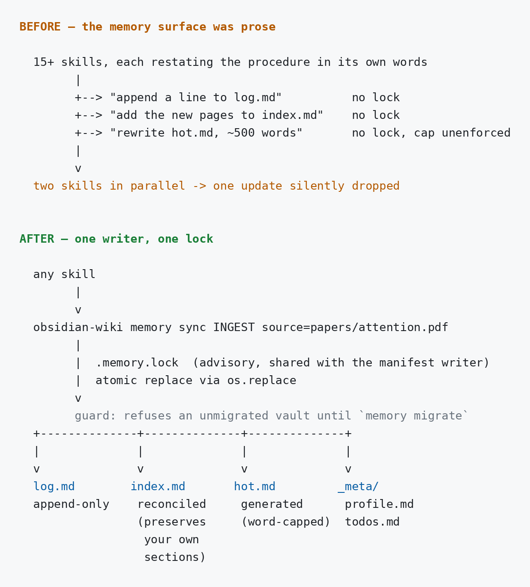

# Architecture

The wiki is the artifact. The agent is the maintainer. Obsidian is the viewer.

No scripts run your knowledge pipeline — the skills are markdown files that tell an AI agent *how* to operate on your vault. The agent uses the same read/write/search tools it already has.

## The four stages

Every time you feed the brain, it runs through these:

### 1. Ingest

The agent reads your source material directly — markdown, PDFs (with page ranges), JSONL conversation exports, plain text logs, chat exports, meeting transcripts, and images (screenshots, whiteboard photos, diagrams; vision-capable model required). No preprocessing step, no pipeline to run. The agent reads the file the same way it reads code.

### 2. Pull information

From the raw source, the agent pulls out concepts, entities, claims, relationships, and open questions. A conversation about debugging a React hook yields a "stale closure" pattern. A research paper yields the key idea and its caveats. A work log yields decisions and their rationale. Noise gets dropped, signal gets kept.

Each page also gets a 1–2 sentence `summary:` in its frontmatter at write time — later queries use this to preview pages without opening them.

### 3. Merge

New knowledge merges against what's already there. If a concept page exists, the agent updates it: merging new information, noting contradictions, strengthening cross-references. If it's genuinely new, a page gets created. Nothing is duplicated. Sources are tracked in frontmatter so every claim stays attributable.

### 4. Schema

The schema isn't fixed upfront. It emerges from your sources and evolves as you add more. The agent maintains coherence: categories stay consistent, wikilinks point to real pages, the index reflects what's actually there. When you add a new domain, the schema expands without breaking what exists.

A `.manifest.json` tracks every source that's been ingested — path, timestamps, which pages it produced. On the next run, the agent computes the delta and only processes what's new or changed.

## The loop

1. Agent resolves the vault path (`@name` → `$CLAUDE_CONFIG_DIR` instance match → `.env` → global config)
2. Agent reads `.manifest.json` to know what's already been done
3. Agent reads the relevant skill for instructions
4. Agent uses its built-in tools to do the work
5. Agent updates `.manifest.json`, `index.md`, `log.md`, and `hot.md`
6. Output is standard Obsidian-compatible markdown with frontmatter and `[[wikilinks]]`

## Code-aware project ingest

`/wiki-update` adds a code-understanding step before distillation when the current project contains source code. Git answers **what changed**; `code-understand` answers **what that change touches**; the agent decides **what is worth remembering**; the vault stores only the distilled result.

With the default `CODE_UNDERSTANDING_BACKEND=auto`, CodeGraph is used when available and the built-in extractor + `rg` is used otherwise. CodeGraph is an optional local accelerator, not part of the vault: its `.codegraph/` index stays beside the project and is never copied into wiki pages.

Use `obsidian-wiki doctor --project .` from the project root to verify CodeGraph availability and index freshness. With `auto`, a healthy CodeGraph backend is preferred; otherwise the built-in fallback is used.

### First project ingest

On the first `/wiki-update`, there is no `last_commit_synced` entry for the project, so the agent needs an initial architecture map:

1. Resolve the vault and read `.manifest.json`; treat the project as new when no previous sync exists.
2. Run `obsidian-wiki code-understand --project "$(pwd)" --pretty` across the tracked project.
3. If CodeGraph is available, the first enhanced run initializes the local `.codegraph/` index. Otherwise the built-in extractor + `rg` produces the focus map.
4. Use the ranked symbols and `file:line` evidence to read the load-bearing code selectively instead of opening the whole repository.
5. Distill architecture, decisions, dependencies, and reusable knowledge into project/global wiki pages.
6. Update `.manifest.json`, `index.md`, `log.md`, and `hot.md`, recording the current `HEAD` as `last_commit_synced`.

```text
project
   ↓
full code-understand pass
   ↓
CodeGraph index (when available)
   ↓
ranked focus map
   ↓
selective source reads
   ↓
LLM distillation
   ↓
Obsidian wiki + last_commit_synced
```

### Ongoing project maintenance

Later `/wiki-update` runs are delta-based. The previous `last_commit_synced` narrows the work to what changed and the impact area around it:

1. Read `last_commit_synced` from `.manifest.json` and verify that commit is still an ancestor of `HEAD`. If history was rewritten, fall back to the first-ingest/full-scan path.
2. Compute the Git delta since the previous sync. If nothing meaningful changed, stop without rewriting the wiki.
3. Run `obsidian-wiki code-understand --project "$(pwd)" --since <last_commit_synced> --pretty`.
4. When CodeGraph is active, reuse the existing local index, sync the changed code, and expand changed files into relevant callers, callees, tests, and impact areas.
5. Read only the ranked affected code, re-check previously recorded relationships, and prune relationships that are no longer valid.
6. Merge only meaningful new knowledge into the wiki, then advance `last_commit_synced` to the current `HEAD`.

```text
last_commit_synced
   ↓
Git delta
   ↓
code-understand --since
   ↓
changed symbols + impact area
   ↓
selective re-read / stale-link pruning
   ↓
LLM distillation
   ↓
updated wiki + new last_commit_synced
```

This keeps the responsibilities separate: Git tracks change history, CodeGraph (or the built-in fallback) maps code structure and impact, the LLM performs judgement and distillation, and the Obsidian vault remains the persistent knowledge artifact.

## Vault structure

```
$OBSIDIAN_VAULT_PATH/
├── index.md                # Master index — every page, always current
├── log.md                  # Chronological activity log
├── hot.md                  # ~500-word semantic snapshot of recent activity (generated)
├── .manifest.json          # Ingest ledger: path, timestamps, pages produced
├── .manifest.lock          # Transient advisory lock held during manifest writes
├── _meta/
│   ├── taxonomy.md         # Controlled tag vocabulary
│   └── *.base              # Obsidian Bases dashboard definitions
├── _insights.md            # Graph analysis: hubs, bridges, dead ends
├── _raw/                   # Staging — drop rough notes, next ingest promotes them
├── _staging/               # Review queue when WIKI_STAGED_WRITES=true
├── _archives/              # Timestamped snapshots for rebuild/restore
├── _readouts/              # Narrative readouts from wiki-narrate
├── concepts/               # Abstract ideas, patterns, mental models
├── entities/               # Concrete things — people, tools, libraries, companies
├── skills/                 # How-to knowledge, techniques, procedures
├── references/             # Factual lookups — specs, APIs, configs
├── synthesis/              # Cross-cutting analysis connecting multiple concepts
├── journal/                # Time-bound entries — daily logs, session notes
└── projects/
    └── <project-name>.md   # One page per project, synced via wiki-update
```

Knowledge that's project-specific goes under `projects/`. Knowledge that's general goes in the global category directories. Both are cross-referenced with `[[wikilinks]]`.

Every page carries required frontmatter: `title`, `category`, `tags`, `sources`, `created`, `updated`.
Optional `snapshots:` (when present) is the page-local projection of ledger invert, written only via the snapshots CLI — the archived files the page was distilled from; `sources:` is unchanged. The CLI serializes a YAML **list** of quoted wikilinks with display text (`"[[_raw/_archived/clip|clip]]"`) so [Obsidian Properties](https://help.obsidian.md/properties) shows a clickable title. Markdown `[title](path)` in that field is plain text, not a link. See [CLI → Snapshot provenance](cli.md#snapshot-provenance-snapshots).

`hot.md` deserves a mention — it's a running semantic snapshot every write skill updates, so the next session picks up where the last one left off without crawling the whole vault. It is generated by `obsidian-wiki memory hot` rather than hand-written, except for `## Key Takeaways`, which is the one slot a model writes on purpose and which survives every rebuild. The ~500-word cap is enforced, not just documented.

Full detail in [Memory Surface](memory.md). Alongside it, `_meta/profile.md` holds durable facts about the vault owner and `_meta/todos.md` holds open threads carried between sessions. `obsidian-wiki memory recap` renders both plus recent activity as one block, which the SessionStart hook injects so a session begins with that context instead of having to go looking for it.

`.manifest.json` is the one file several writers touch at once — parallel ingest subagents from `batch-plan`, and the Dockerized server writing a vault a local skill is also using. Updates to it go through `obsidian-wiki cache-update`, which takes an advisory lock (`.manifest.lock`) and replaces the file atomically. Hand-editing the manifest in a parallel run bypasses that and drops whichever write lands second.



The prose files are protected the same way. `index.md`, `log.md`, `hot.md`, and the `_meta/` tables all go through `obsidian-wiki memory`, which takes its own advisory lock (`.memory.lock`) and replaces each file atomically. `memory sync` holds that lock across the log, index, and hot-cache writes together, so a second writer cannot interleave between the three and leave the snapshot describing a vault state that never existed. Writing those files by hand in a parallel run bypasses the lock, exactly as it does for the manifest.

Manifest `sources` keys (and page `sources:` frontmatter) are portable: vault-relative for in-vault sources, `~`-relative under `$HOME`, or a `repo:`/`url:`/`agent:` pseudo-key — never a machine absolute path, because the vault is synced across machines. Legacy absolute keys keep working, and `scripts/manifest.py migrate <vault>` rewrites them. See [CLI Reference → Source keys and legacy migration](cli.md#source-keys-and-legacy-migration).

## Core principles

- **Compile, don't retrieve.** The wiki is pre-compiled knowledge. Update existing pages — don't append or duplicate.
- **Track everything.** `.manifest.json` after ingesting; `index.md`, `log.md`, and `hot.md` after any write — via `obsidian-wiki memory sync`, not by hand.
- **Connect with `[[wikilinks]]`.** This is what makes it a knowledge graph rather than a folder of files.
- **Frontmatter is required.** Every page, every time.
- **Single source of truth.** Visibility tags shape how content surfaces — they never duplicate or separate it.

## What we added on top of Karpathy's pattern

The [original gist](https://gist.github.com/karpathy/442a6bf555914893e9891c11519de94f) is the seed: compile knowledge once into interconnected markdown and keep it current, instead of asking an LLM the same questions repeatedly or running RAG every time. Here's what got built around it.

- **Delta tracking.** A manifest tracks every source file ingested. Come back later and it computes the delta, processing only what's new or changed. You're not re-ingesting your document library every time.

- **Project-based organization.** Knowledge is filed under projects when project-specific, globally when not. Both cross-referenced. Ten codebases, ten spaces in the vault.

- **Archive and rebuild.** When the wiki drifts too far from its sources, archive the whole thing (timestamped snapshot, nothing lost) and rebuild. Or restore any previous archive.

- **Multi-agent ingest.** Documents, PDFs, Claude Code history, Codex sessions, Hermes memories, OpenClaw `MEMORY.md`, Pi sessions, Copilot CLI history, Windsurf data, ChatGPT exports, Slack logs, meeting transcripts, raw text. Dedicated skills for each agent, plus a catch-all for arbitrary exports.

- **Cross-agent targeted search.** `/wiki-codex "rust ownership"` from inside Claude Code finds your Codex sessions on that topic, extracts the relevant blobs, distills them into pages, and returns a synthesized answer. Topic-first, not session-first. Each agent has its own extraction strategy. Pair with `/memory-bridge diff` to see what each tool uniquely contributed.

- **Audit and lint.** Orphaned pages, broken wikilinks, stale content, contradictions, missing frontmatter — plus a dashboard of what's ingested vs. pending.

- **Identity resolution.** `wiki-dedup` finds pages covering the same concept under different names ("RSC" vs. "React Server Components") and merges them.

- **Automated cross-linking.** After ingest, the cross-linker scans for unlinked mentions and weaves them into the graph.

- **Tag taxonomy.** A controlled vocabulary in `_meta/taxonomy.md`, with a skill that audits and normalizes tags vault-wide.

- **Provenance tracking.** Every claim is tagged: extracted (default), `^[inferred]` (LLM synthesis), or `^[ambiguous]` (sources disagree). A `provenance:` block in frontmatter summarizes the mix per page, and `wiki-lint` flags pages drifting into mostly speculation. You can always tell what your wiki knows from what it guessed.

- **Trust ledger.** `obsidian-wiki trust-record` / `trust-check` record and validate human-approved confidence reviews against material fingerprints, so CI can gate on "a person actually checked this."

- **Multimodal sources.** Screenshots, whiteboard photos, slide captures, and diagrams ingest like text — visible text transcribed verbatim, interpreted content tagged as inferred.

- **Wiki insights.** `wiki-status` can analyze the shape of the vault itself: top hubs, bridge pages (nodes whose removal would partition the graph), tag cluster cohesion, scored surprising connections, a graph delta since last run, and questions the structure is uniquely positioned to answer. Output goes to `_insights.md`.

- **Vault equilibrium.** The maintenance skills (`wiki-lint`, `wiki-dedup`, `cross-linker`, `tag-taxonomy`) each optimize one shared vault for a different objective, so any of them can undo another's work. `wiki-status` equilibrium mode runs every audit in report-only form and reports whether any skill still has a pending change — the vault is converged only when all of them propose nothing. It also detects oscillation, where two skills keep reversing each other and the vault can never settle.

- **Graph export and import.** `wiki-export` turns the wikilink graph into `graph.json`, `graph.graphml` (Gephi/yEd), `cypher.txt` (Neo4j), `postgres.sql` (Postgres), a self-contained interactive `graph.html`, or an OKF bundle. `wiki-import` reads any of it back.

- **Tiered retrieval.** `wiki-query` reads titles, tags, and summaries first, opening page bodies only when the cheap pass can't answer. Say "quick answer" to force index-only mode. Query cost stays roughly flat from 20 pages to 2000.

- **Session brain.** A topic graph over your raw agent session history, so you can find the session where something happened. See [Session Brain](session-brain.md).

- **Staged writes.** Set `WIKI_STAGED_WRITES=true` and LLM-written pages queue in `_staging/` for review before landing in the live vault.

## Open Knowledge Format

The vault format is structurally conformant with [OKF v0.2](https://github.com/GoogleCloudPlatform/knowledge-catalog/blob/main/okf/SPEC.md) — markdown with YAML frontmatter, category subfolders, reserved `index.md`/`log.md`.

`wiki-export` (OKF mode) and `wiki-import` are the bridge: they translate between native frontmatter (`title`/`category`/`tags`/`sources`/`created`/`updated` + `summary`) and OKF (`type`/`title`/`description`/`tags`/`generated`/`sources`, plus `status` and `verified` from lifecycle and trust reviews), making vaults exchangeable with any OKF tool.

The OKF round-trip is lossless. The `graph.json` round-trip is not — it carries structure, not page bodies.

## Repo layout

```
obsidian-wiki/
├── .skills/                             # ← Canonical skill definitions (source of truth)
│   └── <skill-name>/SKILL.md            #   39 skills — see docs/skills.md
│
├── obsidian_wiki/                       # Python package — CLI, setup, sync, session brain
├── extensions/brain/                    # Zero-build Chrome extension: capture + form fill
├── tools/check_readme_sync.py           # Translation drift reporter
│
├── CLAUDE.md                            # Bootstrap → Claude Code / Kilocode (→ AGENTS.md)
├── GEMINI.md                            # Bootstrap → Gemini CLI (→ AGENTS.md)
├── AGENTS.md                            # Bootstrap → Codex, OpenCode, Aider, Droid, Trae, Hermes, OpenClaw
├── .hermes.md                           # Bootstrap → Hermes (symlink → AGENTS.md)
├── .cursor/rules/obsidian-wiki.mdc      # Always-on → Cursor (alwaysApply: true)
├── .windsurf/rules/obsidian-wiki.md     # Always-on → Windsurf
├── .kiro/steering/obsidian-wiki.md      # Always-on → Kiro (inclusion: always)
├── .agent/rules/obsidian-wiki.md        # Always-on → Google Antigravity
├── .agent/workflows/obsidian-wiki.md    # Slash-command registry → Antigravity
├── .github/copilot-instructions.md      # Always-on → GitHub Copilot (VS Code Chat)
│
├── .claude/skills/   → symlinks to .skills/*   (created by setup)
├── .cursor/skills/   → symlinks to .skills/*
├── .windsurf/skills/ → symlinks to .skills/*
├── .agents/skills/   → symlinks to .skills/*
├── .pi/skills/       → symlinks to .skills/*
├── .kiro/skills/     → symlinks to .skills/*
│
├── setup.sh                             # One-command agent setup
├── .env.example                         # Configuration template
└── docs/                                # You are here
```

Global symlink targets created by setup are listed in [Installation](installation.md#what-setupsh-wires-up).

For the full pattern — three-layer architecture, page templates, project organization — read [`.skills/llm-wiki/SKILL.md`](../.skills/llm-wiki/SKILL.md).
